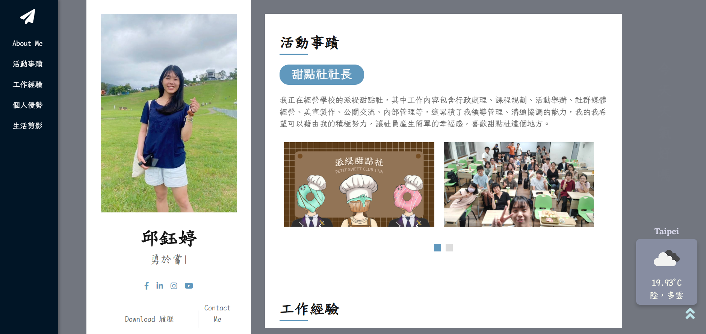
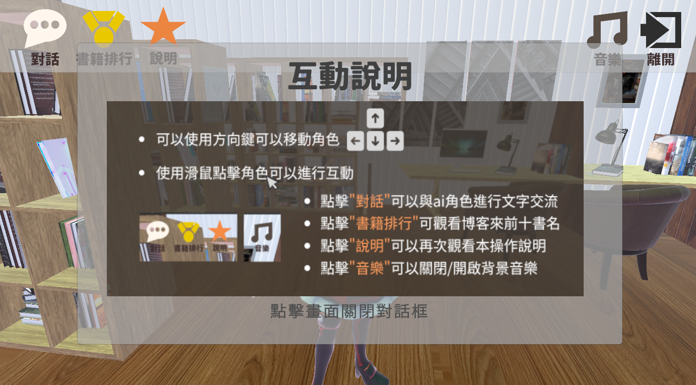

# 歡迎光臨"我的個人成果分享"
### 你好，我是邱鈺婷 :grinning:
這裡會整理我製作的一些小小作品、作業成果，很開心可以與你進行交流。

- [台師大附近-常用Youbike站點即時資訊](#台師大附近-常用Youbike站點即時資訊)
- [個人介紹網站](#個人介紹網站)
- [華麗抽獎網站](#華麗抽獎網站)
- [圖書管理員](#圖書管理員)
- [課程成果github傳送門](#課程成果github傳送門)

## 台師大附近-常用Youbike站點即時資訊
身為一個住在分部，卻在本部上課的師大人，常常需要了解即時的YouBike站點資訊，因此我製作了一個方便"快速"瀏覽師大校區常用腳踏車站點的資訊，不需要在官方軟體上，等待載入時間、尋找站點。

| [網頁展示](https://mocuacqu.github.io/ntnuYoubike/) | [程式分享](https://github.com/MocuAcqu/ntnuYoubike) |
|--|--|

## 個人介紹網站
這是來自於網際網路概論課堂的成果，我製作了一個展示我個人資訊的網頁，讓其他人可以透過一頁式網站認識我。

| [網頁展示](https://mocuacqu.github.io/personalWeb1/) | [程式分享](https://github.com/MocuAcqu/personalWeb1) |
|--|--|

 |  |  |
 |--|--|

## 華麗抽獎網站
這是來自於網際網路概論課堂的期末專題，我們希望帶來一個多元且更有儀式感的線上抽獎工具，並結合資料庫(supabase)製作即時抽獎的效果，功能包含即時抽獎、資料抽獎、轉輪盤、擲骰子、隨機數字等功能。

* 抽獎網站
  | [程式碼](https://github.com/MocuAcqu/1131Lottery) | [實作網站](https://mocuacqu.github.io/1131Lottery/) | [影片解說](https://youtu.be/E1m29F7tk0Y?si=4R1AmqkEFwFT91TD) |
  |--|--|--|
* 即時抽獎-登入資料介面
  | [程式碼](https://github.com/MocuAcqu/1131Lottery-users-signIn) | [實作網站](https://mocuacqu.github.io/1131Lottery-users-signIn/) |
  |--|--|

  |  |  |  |
  |--|--|--|

## 圖書管理員
這是來自程式語言課程的期末專題，我結合Unity、大型語言模型、Hugging face、爬蟲等工具，在unity中製作一款可互動的人物，他會以圖書管理員的身分推薦書籍，並且可以在其中看到來自博客來的前十書籍排行榜等。
  
 | [程式碼](https://github.com/MocuAcqu/NTNU_PL_Library) | [解說影片](https://youtu.be/Xl6CxgXtN0w) |
 |--|--|

 |  |  |  |
 |--|--|--|

## 課程成果github傳送門
這裡會分享我在一些課堂中的github連結，可以快速了解我在該課程中的成果，以更詳細的資料分享。

(1) 網際網路概論 https://github.com/MocuAcqu/web?tab=readme-ov-file

(2) 程式語言 https://github.com/MocuAcqu/PL-class

(3) 資料結構 https://github.com/MocuAcqu/1132Database

(4) 教育大數據專題製作 https://github.com/MocuAcqu/Chrome_test

## 🤝 聯絡我
如果你有任何問題或建議，隨時可以聯絡我！💬

- GitHub: [MocuAcqu](https://github.com/MocuAcqu)
- Email: [a0901422997@gmail.com](mailto:a0901422997@gmail.com) 
