# 歡迎光臨"我的課程個人成果分享"
### 你好，我是邱鈺婷 :grinning:
這裡會整理我製作的一些大學課程中的小小作品、作業成果，很開心可以與你進行交流。

- [台師大附近-常用Youbike站點即時資訊](#台師大附近-常用Youbike站點即時資訊)
- [個人介紹網站](#個人介紹網站)
- [華麗抽獎網站](#華麗抽獎網站)
- [圖書管理員](#圖書管理員)
- [英文寫作分析器](#英文寫作分析器)
- [釣魚信件分析器](#釣魚信件分析器)
- [TKP trade can be possible](#TKP_trade_can_be_possible)
- [Tina 的人生模擬器](#Tina的人生模擬器)
- [智慧貨幣收集家](#智慧貨幣收集家)
- [Enigma 模擬器](#Enigma模擬器)
- [畢業專題OnomaRise-LandingPage](#畢業專題OnomaRise-LandingPage)
- [3D玩創意-blender動畫](#3D玩創意-blender動畫)
- [AI影像辨識-入門實作](#AI影像辨識-入門實作)
- [課程成果github傳送門](#課程成果github傳送門)

## 台師大附近-常用Youbike站點即時資訊
身為一個住在分部，卻在本部上課的師大人，常常需要了解即時的YouBike站點資訊，因此我製作了一個方便"快速"瀏覽師大校區常用腳踏車站點的資訊，不需要在官方軟體上，等待載入時間、尋找站點。

| [網頁展示](https://mocuacqu.github.io/ntnuYoubike/) | [程式分享](https://github.com/MocuAcqu/ntnuYoubike) |
|--|--|

## 個人介紹網站
這是來自於網際網路概論課堂的成果，我製作了一個展示我個人資訊的網頁，讓其他人可以透過一頁式網站認識我。

| [網頁展示](https://mocuacqu.github.io/personalWeb1/) | [程式分享](https://github.com/MocuAcqu/personalWeb1) |
|--|--|

 | 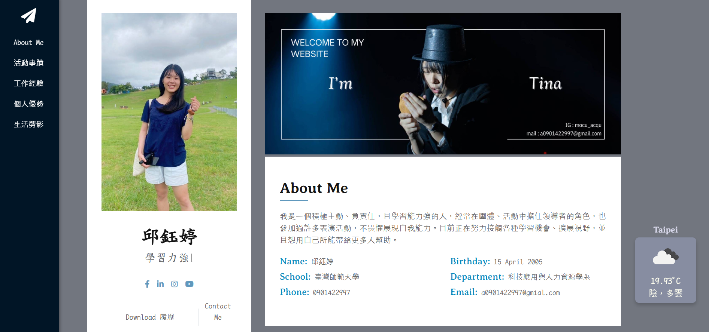 | 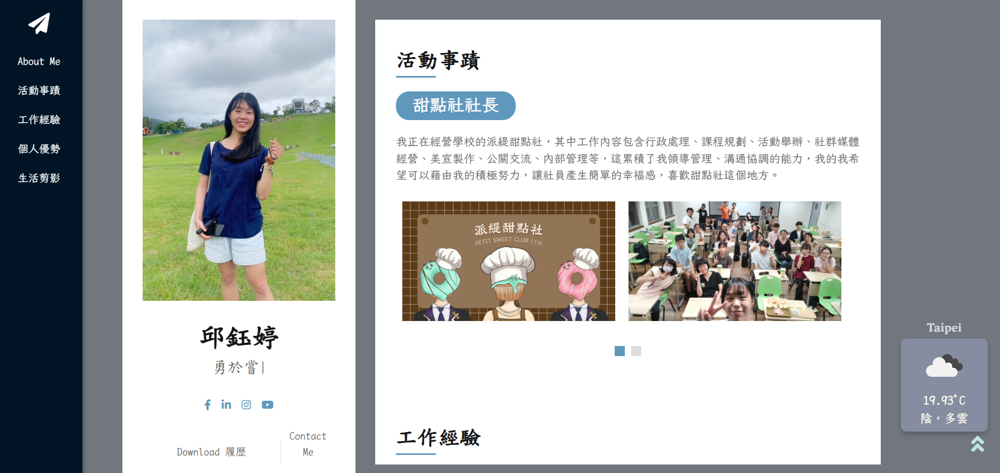 |
 |--|--|

## 華麗抽獎網站
這是來自於網際網路概論課堂的期末專題，我們希望帶來一個多元且更有儀式感的線上抽獎工具，並結合資料庫(supabase)製作即時抽獎的效果，功能包含即時抽獎、資料抽獎、轉輪盤、擲骰子、隨機數字等功能。

* 抽獎網站
  | [程式碼](https://github.com/MocuAcqu/1131Lottery) | [實作網站](https://mocuacqu.github.io/1131Lottery/) | [影片解說](https://youtu.be/E1m29F7tk0Y?si=4R1AmqkEFwFT91TD) |
  |--|--|--|
* 即時抽獎-登入資料介面
  | [程式碼](https://github.com/MocuAcqu/1131Lottery-users-signIn) | [實作網站](https://mocuacqu.github.io/1131Lottery-users-signIn/) |
  |--|--|

  | 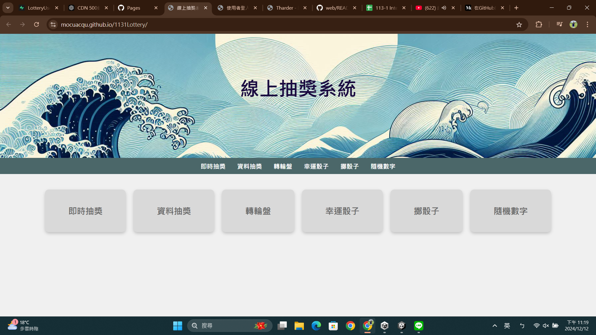 | 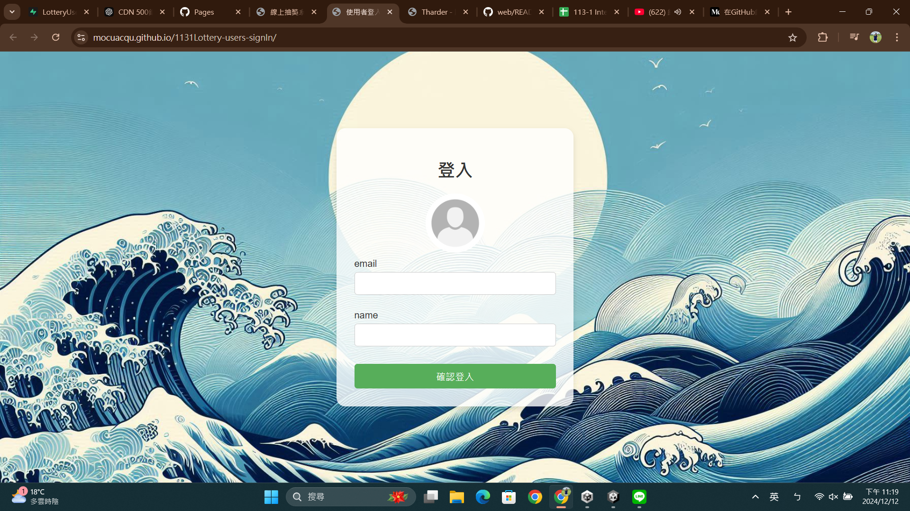 | 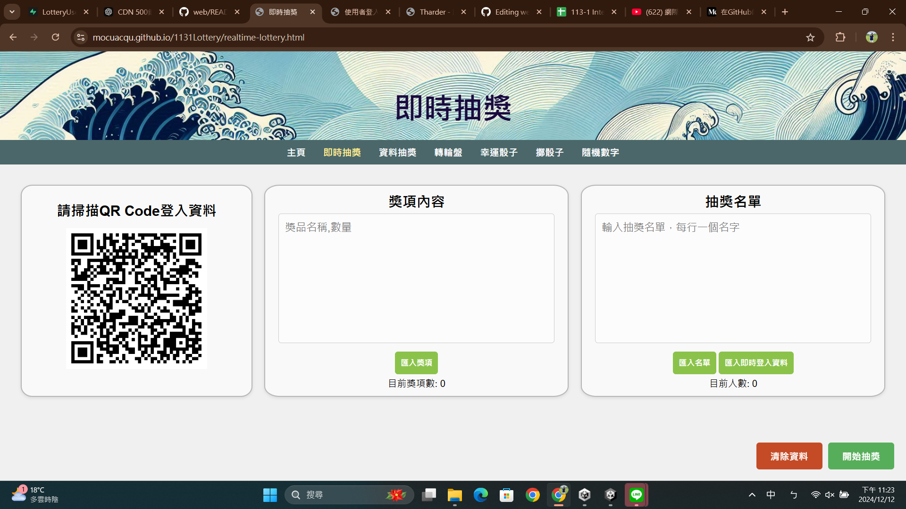 |
  |--|--|--|

## 圖書管理員
這是來自程式語言課程的期末專題，我結合Unity、大型語言模型、Hugging face、爬蟲等工具，在unity中製作一款可互動的人物，他會以圖書管理員的身分推薦書籍，並且可以在其中看到來自博客來的前十書籍排行榜等。
  
 | [程式碼](https://github.com/MocuAcqu/NTNU_PL_Library) | [解說影片](https://youtu.be/Xl6CxgXtN0w) |
 |--|--|

 | 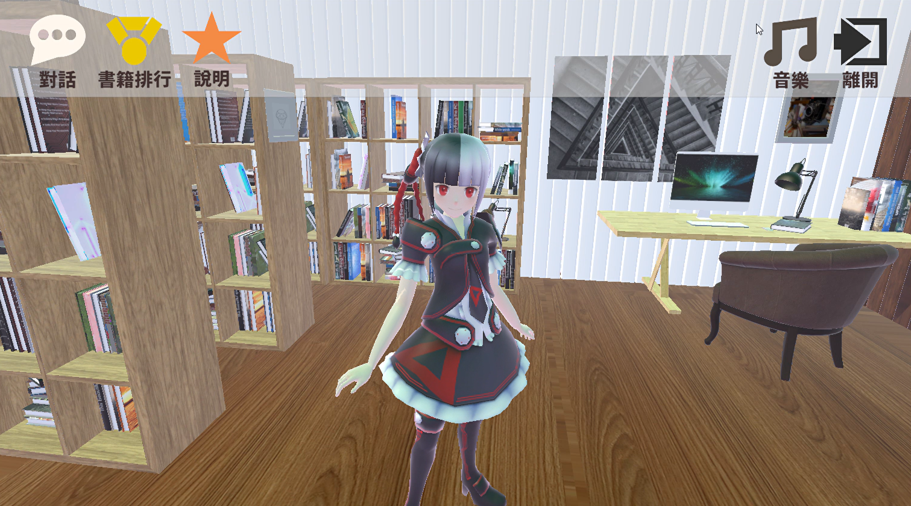 | 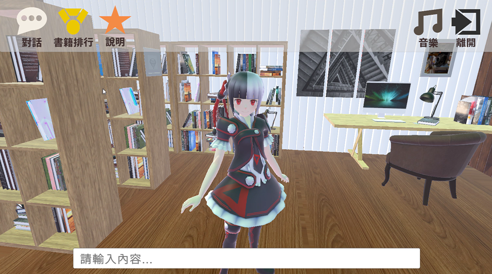 | 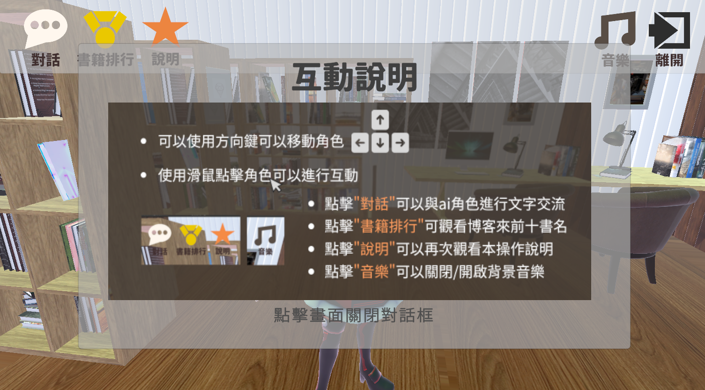 |
 |--|--|--|

## 英文寫作分析器
這是來自資料結構課程的期末專題，我串接大型語言模型 (Gemini-1.5-Flash)，藉由下達指令讓他生成明確的分析結果內容，並藉由資料庫 (supabase) 儲存使用者帳號與分析結果的歷史紀錄。在前端還結合 Quill 讓使用者可以編輯生成結果，下載成修改版本的 PDF 檔案。

 | [程式碼](https://github.com/1132DatabaseProject/DatabaseProject/blob/main/app.py) | [解說影片](https://youtu.be/VyQuufedhH8?si=USVLJQSPN4c72DH9) |
 |--|--|

 | 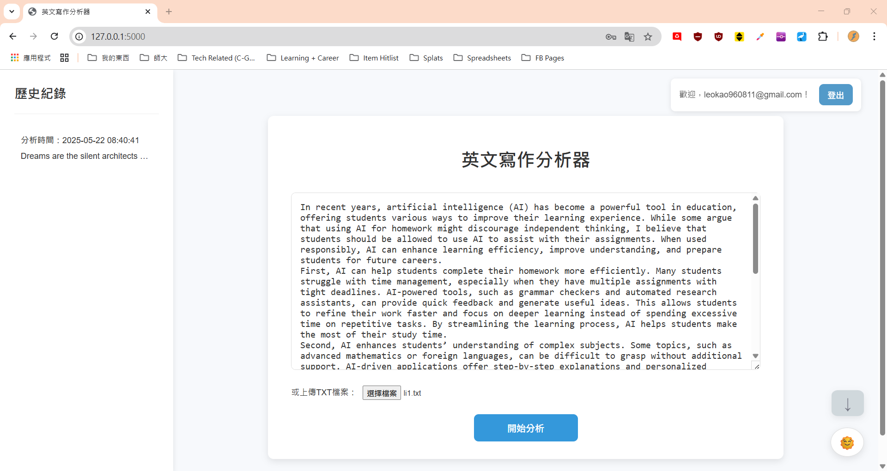 | 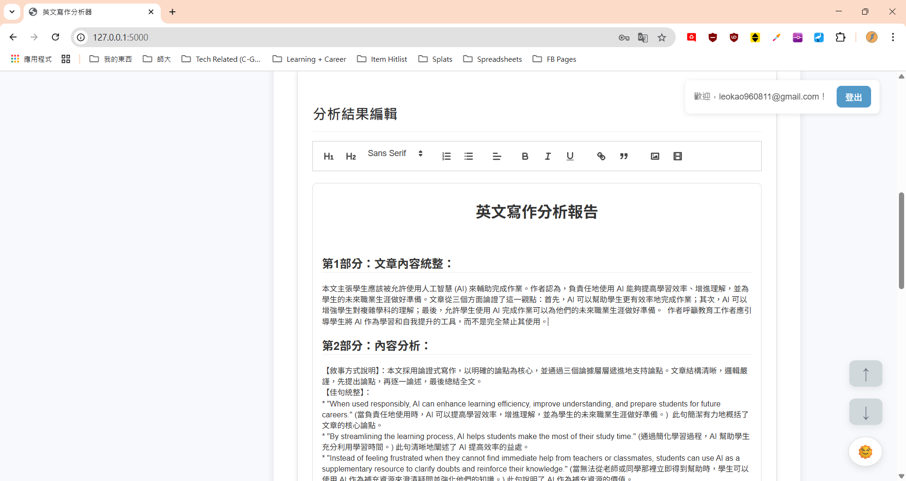 | 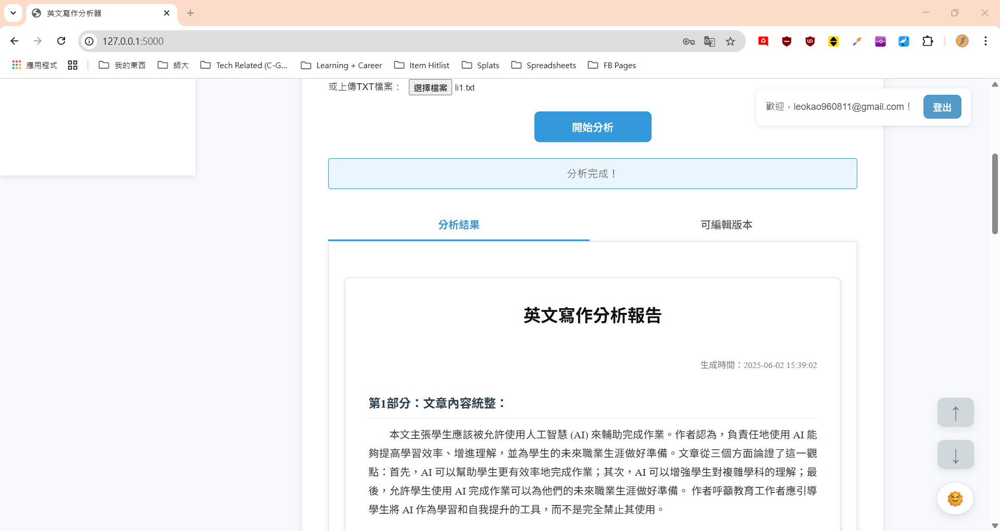 |
 |--|--|--|

## 釣魚信件分析器
這是來自教育大數據專題製作課程的專題成果，我們透過 Autoencoder 建立一個判斷釣魚網址的模型，作出一個可以使用在 Gmail 信件的 Chrome 擴充工具。

 | [程式碼](https://github.com/MocuAcqu/BigData/tree/main/extension) | 
 |--|

   | 批次分析功能 Before | 批次分析功能 After | 單封信分析功能 Before | 單封信分析功能 After |
  |:-:|:-:|:-:|:-:|
  |||||

## WorldKC 盲人點字學習 APP
這是使用 APP inventor 開發一款盲人點字學習軟體「WorldKC」，因發現存在著非視覺障礙者卻需要學習盲人點字的情況，例如視障者的家屬、盲人點字的相關設計者、特教老師等，而市面上有著眾多語言學習工具，卻鮮少有可翻譯、查字典和擁有學習測驗的盲人點字學習工具，因此我結合聲音與圖像，設計了有多種互動方式的學習器。

| [介紹簡報](https://canva.link/xfd0mgn7d0p2pqj) |
|--|

 | 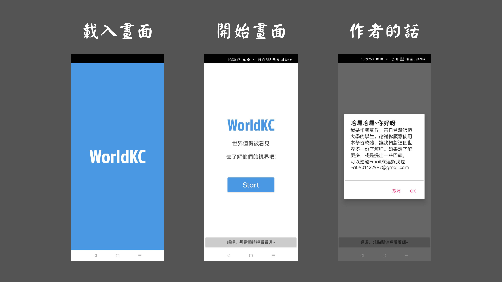 | 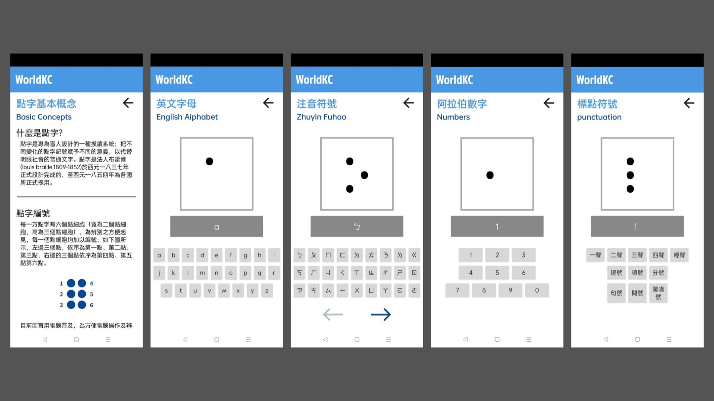 | 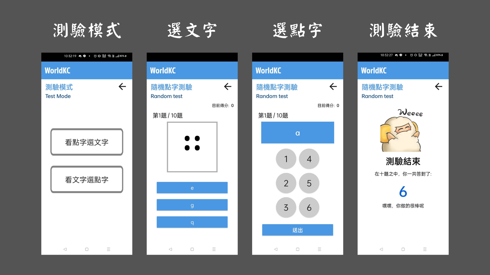 |
 |--|--|--|

## TKP_trade_can_be_possible
這是來自資料庫系統課程的專題成果，我們運用 MongoDB 去製作一個集結買賣、交換和租賃於一體的平台。我們的目標是打造一個能夠更快、更透明地連接「物品」和「需求」的平台。

 | [程式碼 repo](https://github.com/MocuAcqu/DB_finalPJ_TKP) | [成果影片](https://youtu.be/QfTn0Um9Gx0?si=l8dfkdM0ZTjmLvuM)|
 |--|--|

||||
|:--:|:--:|:--:|

## Tina的人生模擬器
這是我在程式設計課程的期末成果，我重新設計了個人網站，結合課程使用 JS 製作互動遊戲的元素，使得我的個人網站可以切換不同對應我現實身分的角色(學生、工作者、社團人、原作者)，並進行15天的模擬器互動，每天會有8個選項隨機出現4個，並且有12種不同結局。
 | [成果網站](https://etech.gac.ntnu.edu.tw/jsa14a/99%20(final)/41271124H%20Tina%e7%9a%84%e4%ba%ba%e7%94%9f%e6%a8%a1%e6%93%ac%e5%99%a8/) | 
 |--|
 
 (此個人網站預計會持續改版並使用 render 做為未來部屬方式，已有更新版本: https://tina-s-life-personal-website.onrender.com/)

|  |
|--|

## 智慧貨幣收集家
這是一個結合影像辨識、匯率換算、集幣冊、貨幣資訊等元素的行動教學教材，希望透過多元技術與功能，讓大家可以透過這款教材，開啟認識貨幣價值的動機，看見才在貨幣中的文化故事、實際應用與歷史意義。

 | [程式碼 repo](https://github.com/MocuAcqu/1141Currency_Learning_Materials) | 
 |--|

|  |
|--|

## Enigma模擬器
這是我在區塊練與加密貨幣課程中，模擬｢恩尼格瑪機｣加密、解密機制所製作的一個網頁。包含模擬 ENIGMA 轉軸、顯示燈、字母鍵盤、接線板，讓英文內容可以加密成一段無法直接閱讀理解的英文亂碼，並透過相同線路設定，依照亂碼順序解密成員文內容，以及歷史故事介紹、運作原理解析、參考密碼表。

 | [程式碼 repo](https://github.com/MocuAcqu/enigma_simulator) |[成果網站](https://mocuacqu.github.io/enigma_simulator/) |
 |--|--|

 |  |  |
|--|--|

## 畢業專題OnomaRise-LandingPage
這個是用來畢業專題期中審查時，展示樣貌用的 LandingPage，包含介紹專案核心理念:讓抽象的音樂理論直觀可見，提供 Github 原始碼、介紹主要三大功能、說明痛點解決與優勢。並用 Google sheet 簡單製作資料庫，存取未來願意測試網站之人的 Gmail。

 | [程式碼 repo](https://github.com/MocuAcqu/OnomaRise-LandingPage) |[成果網站](https://mocuacqu.github.io/OnomaRise-LandingPage/) |
 |--|--|

|  |
|--|

## 3Dmax電腦動畫成果
這個是我在電腦動畫課程中，課程中與期中、期末的3D建模與動畫成果。
|[骨牌動畫](https://youtu.be/uPuGC2yGL_c?si=IT37dZa942WlbxVx)|[升空熱氣球](https://youtu.be/sbxGR7LKNOM?si=Cyf52cjkuafwq2Qq)|[期中成果影片-黃色雨傘](https://youtu.be/lfmbNTacAeU?si=mjDkVw06SYIK5i7N)|[期末成果影片](https://youtu.be/hGUXQZ_lQCU?si=iz2rec-YWMb-hBhU)|
|--|--|--|--|

## 3D玩創意-blender動畫
這個是我在3D玩創意課程中，使用 blender 製作的場景、腳色建模與動畫製作，成果是依照 Dream Sequence 3D Community Challenge 的格式來創作的。
|[期末成果影片](https://youtu.be/M_1yYnrHRdw?si=dbLu5_lt-4kQFilo)|
|--|

## AI影像辨識-入門實作
這個是 AI 影像識別入門與實作課程的作業，包含我利用 MediaPipe 以手部姿態控制視訊錄影，以及我實作 dlib-face-recognition 的過程。
|[MediaPipe 以手部姿態控制視訊錄影](https://youtu.be/jYCBV0Xs_2k?si=GuKm5aPDCAaCns9i)|[dlib-face-recognition簡報](https://canva.link/yfr44nmbcm5ttgz)|
|--|--|

## 課程成果github傳送門
這裡會分享我在一些課堂中的github連結，可以快速了解我在該課程中的成果，以更詳細的資料分享。

(1) 網際網路概論 https://github.com/MocuAcqu/web?tab=readme-ov-file

(2) 程式語言 https://github.com/MocuAcqu/PL-class

(3) 資料結構課程學習 https://github.com/MocuAcqu/1132Database

(4) 資料結構期末報告 https://github.com/1132DatabaseProject/DatabaseProject?tab=readme-ov-file

(5) 教育大數據專題製作 https://github.com/MocuAcqu/BigData

(6) 資料庫系統 https://github.com/MocuAcqu/1141DB

(7) 程式設計 https://github.com/MocuAcqu/1141-GAC-programing-project

(8) 多媒體教材設計與製作 https://github.com/MocuAcqu/1141Currency_Learning_Materials

(9) 畢業專題 https://github.com/MocuAcqu/onoma-rise

## 🤝 聯絡我
如果你有任何問題或建議，隨時可以聯絡我！💬

- GitHub: [MocuAcqu](https://github.com/MocuAcqu)
- Email: [a0901422997@gmail.com](mailto:a0901422997@gmail.com) 
